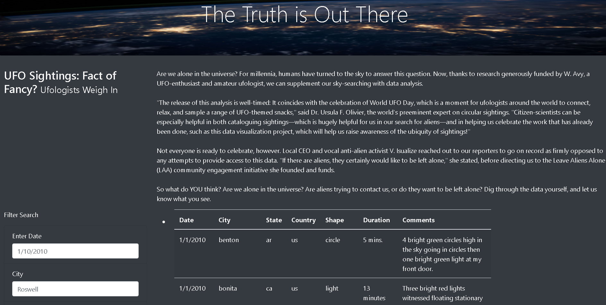
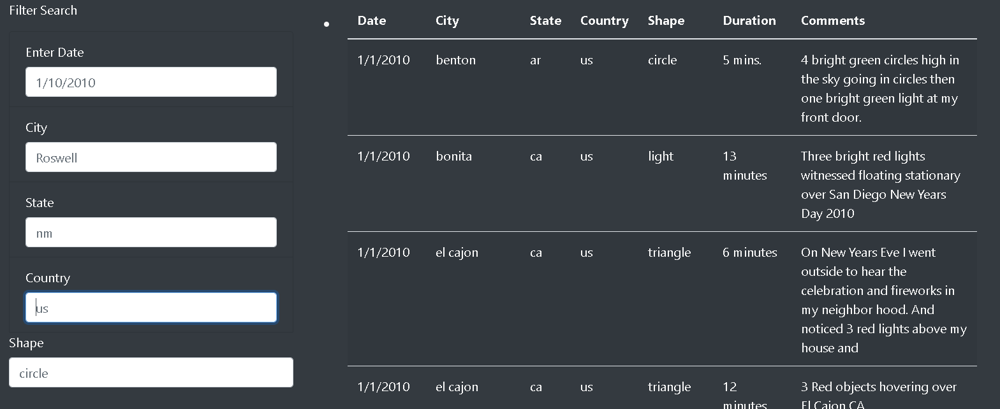
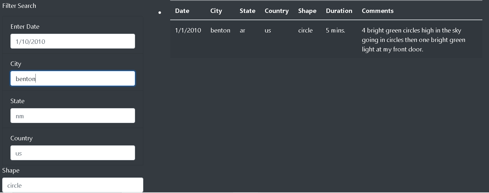

# UFOs

#### Overview:

The objective was to create a website that can dynamically filter and display data from a UFO database based on user input.  

#### Results:

The website functions as requested see below for a quick tutorial.

This is the view when the website is opened.  All of the data is not filtered at this point.

On the left had side of the site you can see some empty text boxes which are used to modify the filtering of the data, see below for reference.

To modify the filter simply type what you would like to filter on in one or more of the text boxes.  Below you can see the data if filtered by a city name.

You can use all of the filter boxes together or just one at a time to narrow down your query.

#### Summary:

Though the site is useful there are drawbacks to how it is set up.  two of them are listed below.

* It was created on a static dataset.
* The filters require exact entry and are case sensitive.  The filter will not work if there is a typing error.

Some additional development that I would recommend are listed below

* Add additional filters for all column headers.
* Connect to a live UFO database for more up to date information.
* Create Excel style drop down menus to control the filters instead of text entry to eliminate typing errors.